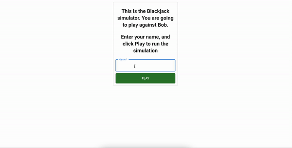

# Blackjack simulator



Project is hosted on [nikodemwrona.dev/blackjack](https://nikodemwrona.dev/blackjack)

Services are deployed on Kubernetes cluster.

The application consists of two microservices:
- web
- api

`web service` is a simple web app build with Next.js 

`api service` is a simple REST API build with Nest.js

both services use `Typescript`

---
To run the project locally you can use the following commands:

in the `/services/api`:
```
yarn start:dev
```

in the `/services/web`:
```
yarn dev
```
then go to [http://localhost:3000/blackjack](http://localhost:3000/blackjack)

### Development

To start development first install node_modules with the following command in root folder:
```
yarn
```
The monorepo uses `yarn workspaces` to manage dependencies in the `services` folder.

To run `api service` unit tests go to `/services/api` and  run the following command:
```
yarn test
```

To run `api service` e2e tests go to `/services/api` and  run the following command:
```
yarn test:e2e
```

To check the code coverage of `api service` run the following command:
```
yarn test:cov
```

## Road to production

Production ready improvements can be found [here](https://nikodemwrona.notion.site/Blackjack-Simulator-Notes-2365b194b30240c9899a0b6540fc28c7).
